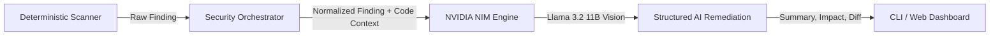

# 🛡️ VibeGuard

<div align="center">

```text
    ,-----.       __     __ ___ ____  _____ ____ _   _   _   ____  ____  
  /    _    \    \ \   / /|_ _| __ )| ____/ ___| | | | / \ |  _ \|  _ \ 
 |   /   \   |    \ \ / /  | ||  _ \|  _|| |  _| | | |/ _ \| |_) | | | |
 |  |  ✓  |  |     \ V /   | || |_) | |___| |_| |_| / ___ \  _ <| |_| |
  \  \   /  /       \_/   |___|____/|_____|\____|\___/_/   \_\_| \_\____/
   `-------'     AI-Powered DevSecOps Orchestrator
                 Scanning. Analyzing. Protecting.
```

[](https://www.npmjs.com/package/@maverick006/vibeguard)
[](LICENSE)
[](https://www.typescriptlang.org/)
[](https://react.dev/)
[](https://tailwindcss.com/)
[](https://build.nvidia.com/)
[](https://www.docker.com/)

**VibeGuard** is an enterprise-grade DevSecOps orchestration engine and AI remediation platform. It unifies deterministic security scanners (SAST, SCA, Secrets, IaC, Containers) into a normalized pipeline, calculates a mathematical risk score, and generates instant, context-aware code fixes powered by **NVIDIA NIM**.

[Quick Start](#-quick-start) • [CLI Dashboard](#-cyberpunk-terminal-cli) • [Web Dashboard](#-web-dashboard) • [Architecture](#-architecture) • [AI Remediation](#-ai-remediation-engine)

</div>

---

## ⚡ Quick Start

Run VibeGuard instantly on any repository or codebase without installing anything:

```bash
# Run a security scan in the current directory
npx @maverick006/vibeguard@latest scan .

# Run a scan with automated AI remediation & code diffs
npx @maverick006/vibeguard@latest scan --fix
```

---

## 💻 Cyberpunk Terminal CLI

VibeGuard features a terminal UI dashboard with real-time risk scoring, multi-scanner pipeline tracking, and interactive AI remediation diffs:

```text
                                                                 16:50:50
    ,-----.       __     __ ___ ____  _____ ____ _   _   _   ____  ____  
  /    _    \    \ \   / /|_ _| __ )| ____/ ___| | | | / \ |  _ \|  _ \ 
 |   /   \   |    \ \ / /  | ||  _ \|  _|| |  _| | | |/ _ \| |_) | | | |
 |  |  ✓  |  |     \ V /   | || |_) | |___| |_| |_| / ___ \  _ <| |_| |
  \  \   /  /       \_/   |___|____/|_____|\____|\___/_/   \_\_| \_\____/
   `-------'     AI-Powered DevSecOps Orchestrator
                 Scanning. Analyzing. Protecting.

┌──────────────────────────────────────────────────────────────────────────┐
│  OVERALL RISK SCORE                                                      │
│                                                                          │
│   38 /100            CRITICAL     2           HIGH         3             │
│   CRITICAL RISK      MEDIUM       3           LOW          2             │
└──────────────────────────────────────────────────────────────────────────┘

▶ SCANNER PIPELINE                    ▶ TOP FINDINGS
</>  SAST (Semgrep)           ✓ OK    ID            SEVERITY   TITLE                        FILE:LINE
📦   Dependency Check (Trivy) ✓ OK    VG-CRIT-001   CRITICAL   Hardcoded AWS Secret Key     config/aws.py:12
🔑   Secrets Scan (Gitleaks)  ✓ OK    VG-CRIT-002   CRITICAL   Exposed JWT Secret           config/auth.py:8
🔒   IaC Scan (Checkov)       ✓ OK    VG-HIGH-003   HIGH       SQL Injection Risk           api/users.py:45
🐳   Container Scan (Trivy)   ✓ OK    VG-HIGH-004   HIGH       Outdated Dependency (lodash) package.json:23
📑   Code Quality (ESLint)    ✓ OK    VG-HIGH-005   HIGH       Unsafe Deserialization       utils/parser.py:78
                                      VG-MED-006    MEDIUM     S3 Bucket Public Read        iac/s3.tf:14
▶ REPOSITORY                          VG-MED-007    MEDIUM     Missing Rate Limiting        api/auth.py:32
Name:      VibeGuard                  VG-MED-008    MEDIUM     CORS Misconfiguration        web/middleware.py:19
Branch:    main                       VG-LOW-009    LOW        Unused Dependency            package.json:102
Commit:    08e51ec                    VG-LOW-010    LOW        Missing Security Headers     web/server.py:56
Scan Time: 1.6s                       
Policy:    enterprise                 

▶ AI REMEDIATION (VG-AI)

Finding: VG-CRIT-001

Issue
A hardcoded AWS Secret Key has been found in the source code.

Impact
This can lead to unauthorized access to your AWS resources and cloud infrastructure.

Recommendation
Store sensitive information like AWS Secret Keys securely using environment variables or a secrets manager.

Suggested Fix
┌────────────────────────────────────────────────────────────┐
│ AWS_SECRET_KEY = os.environ['AWS_SECRET_KEY']              │
└────────────────────────────────────────────────────────────┘

Confidence: 98%

▶ SUMMARY
┌─────────────────────────────────────────────────────────────────┐
│  🛡️   Scan completed in 1.6s   │   10 findings   │   6 passed  │
└─────────────────────────────────────────────────────────────────┘
```

---

## 🌟 Key Features

* **🛡️ Modular Deterministic Scanners**: Supports SAST (Semgrep), SCA (Trivy / npm-audit), Secrets Detection (Gitleaks), Infrastructure-as-Code (Checkov), Container Scanning (Trivy), and Web Security (OWASP ZAP).
* **🧮 Mathematical Risk Scoring**: Pure deterministic algorithm that deduces risk points from 100 based on finding severity (Critical, High, Medium, Low) and calculates an enterprise security grade.
* **🤖 NVIDIA NIM AI Engine**: Direct integration with `meta/llama-3.2-11b-vision-instruct` to analyze finding context, assess exploit impact, and output exact code fixes and replacements.
* **🎨 Glassmorphic React Dashboard**: Dark-mode web interface built with React 19, Tailwind CSS v4, Lucide icons, and Recharts analytics.
* **📦 Global NPM Distribution**: Published under `@maverick006/vibeguard` with zero mandatory setup.
* **🐳 Docker & Cloud Ready**: Complete Docker Compose setup for local containerization or instant cloud deployment to Render and Vercel.

---

## 🏗️ Architecture

VibeGuard is built as a highly structured **NPM Workspaces Monorepo**:

```text
vibeguard-monorepo/
├── apps/
│   ├── web/                    # React 19 Frontend Dashboard (Vite + Tailwind v4)
│   └── api/                    # Express.js REST API + Prisma SQLite backend
├── packages/
│   ├── cli/                    # Published CLI (@maverick006/vibeguard)
│   ├── ai-engine/              # NVIDIA NIM AI Explainer & Remediation Engine
│   ├── security-engine/        # Core Orchestrator & Scoring Algorithms
│   ├── database/               # Prisma Schema & Database Client
│   └── types/                  # Shared TypeScript Interfaces & Enums
├── scanners/
│   ├── npm-audit/              # Node.js Dependency Scanner Adapter
│   ├── semgrep/                # SAST Static Analysis Adapter
│   ├── gitleaks/               # Secrets & Credential Leak Adapter
│   ├── trivy/                  # Container & Vulnerability Scanner
│   ├── checkov/                # Infrastructure as Code (IaC) Scanner
│   └── zap/                    # Dynamic Application Security Testing (DAST)
└── docker-compose.yml          # Containerized deployment
```

---

## 🛠️ Local Development Setup

### Prerequisites
* Node.js `>= 20.0.0`
* npm `>= 9.0.0`
* (Optional) `NVIDIA_API_KEY` for AI Remediation

### 1. Clone & Install
```bash
git clone https://github.com/Maverickrd007/VibeGuard.git
cd VibeGuard

npm install
```

### 2. Environment Setup
Create a `.env` file in the root directory:
```env
NVIDIA_API_KEY=nvapi-your-key-here
PORT=3001
DATABASE_URL="file:./dev.db"
```

### 3. Build Workspaces
```bash
npm run build --workspaces
```

### 4. Start Development Servers
```bash
# Start Backend API (Port 3001)
npm run dev --workspace=apps/api

# Start Web Dashboard (Port 5173)
npm run dev --workspace=apps/web
```

### 5. Run Local Docker Stack
```bash
docker-compose up --build
```

---

## 🤖 AI Remediation Engine

VibeGuard utilizes NVIDIA NIM endpoints with the `meta/llama-3.2-11b-vision-instruct` model to perform structured vulnerability remediation:



1. The scanner flags a vulnerability and extracts surrounding code lines.
2. VibeGuard builds a strict contextual prompt containing the CWE, OWASP category, file path, line numbers, and snippet.
3. NVIDIA NIM generates a structured remediation plan including **Issue Summary**, **Exploit Impact**, **Recommendation**, and a **Copy-Paste Code Fix**.

---

## 📜 CLI Options

```bash
Usage: vibeguard scan [options] [path]

Run a security scan on the current directory or target path

Options:
  -d, --dir <path>   Directory to scan (default: current directory)
  --fix              Automatically generate AI remediation fixes and diffs
  --demo             Showcase the complete security dashboard with sample findings
  -h, --help         Display help for command
```

---

## 📄 License

This project is licensed under the **MIT License** - see the [LICENSE](LICENSE) file for details.

Developed with ❤️ by **[Raghav (Maverickrd007)](https://github.com/Maverickrd007)**.
